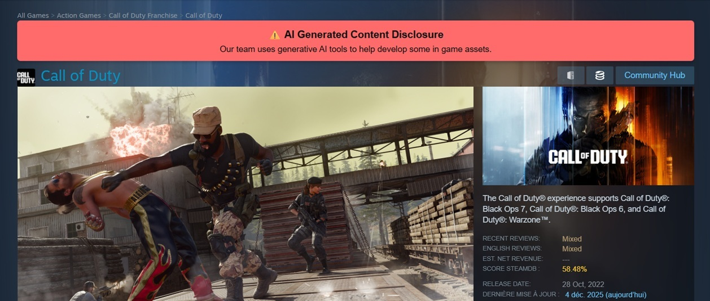
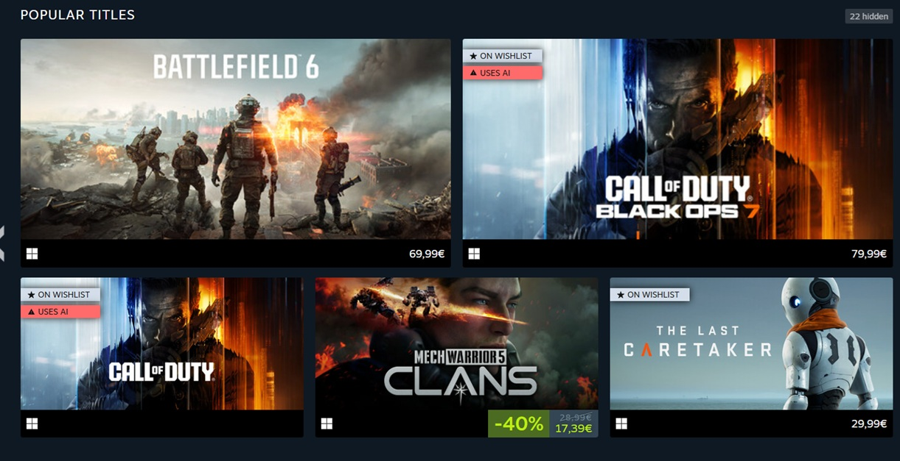
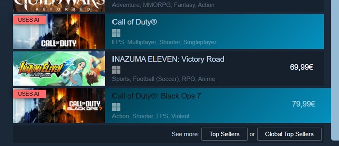

# Steam AI Games Indicator

A collection of userscripts that help you identify games on Steam that use AI-generated content.

Since late 2024, Steam requires developers to disclose if their games contain AI-generated content. These scripts make this information more visible by adding visual indicators throughout the Steam store.

## Scripts

### 1. Steam AI Banner

Displays a prominent banner at the top of individual game pages when a game has disclosed AI-generated content.

### 2. Steam AI Badge

Adds "Uses AI" badges to game tiles throughout the Steam store.

## Installation

1. Install a userscript manager for your browser:
   - [Tampermonkey](https://www.tampermonkey.net/) (Chrome, Firefox, Edge, Safari, Opera)
   - [Violentmonkey](https://violentmonkey.github.io/) (Chrome, Firefox, Edge, Opera)
   - [Greasemonkey](https://www.greasespot.net/) (Firefox)

2. Install the scripts:
   - [Steam AI Banner](https://raw.githubusercontent.com/Pierre-Demessence/SteamAIGamesIndicator/main/steamAIBanner.js)
   - [Steam AI Badge](https://raw.githubusercontent.com/Pierre-Demessence/SteamAIGamesIndicator/main/steamAIBadge.js)

## How It Works

**Steam AI Banner** checks individual game pages for the "AI Generated Content Disclosure" section and displays the disclosure text in a visible banner.

**Steam AI Badge** uses a combination of:
1. A pre-built list of known AI games (`appids.json`) fetched from this repository
2. Background fetching of individual game pages for games not in the list

The badge script caches the known AI games list locally for 24 hours to minimize network requests.

## Contributing

If you find a game that uses AI-generated content but isn't being detected, please open an issue or submit a pull request to add the app ID to `appids.json`.

## License

This project is licensed under the MIT License - see the [LICENSE](LICENSE) file for details.

## Disclaimer

This project is not affiliated with Valve or Steam. The AI disclosure information is sourced directly from Steam's official game pages.
